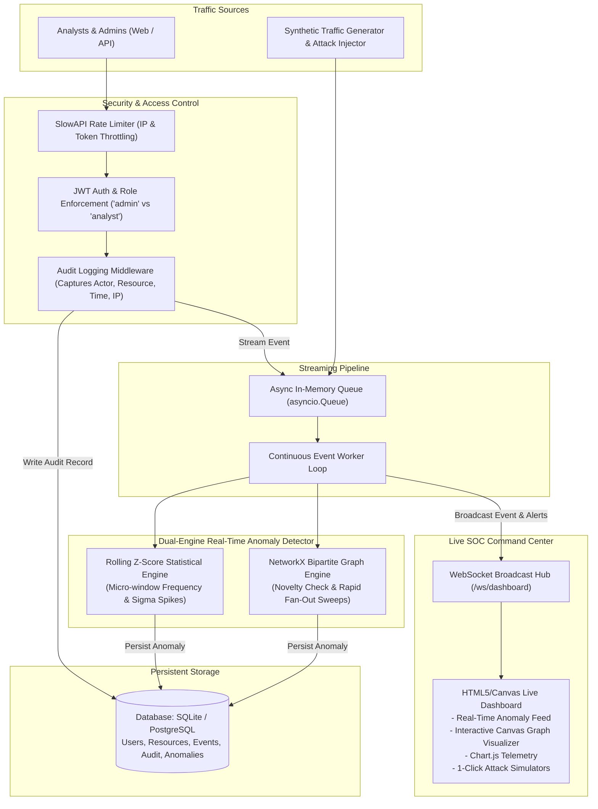

# SentinelShield: Real-Time Data Access Anomaly Detection & SOC Platform

[](https://www.python.org/downloads/)
[](https://fastapi.tiangolo.com)
[](https://www.sqlalchemy.org/)
[](https://networkx.org/)
[]()
[]()

**SentinelShield** is an end-to-end, production-grade real-time data access monitoring and anomaly detection system with security hardening. Built with Python, FastAPI, SQLAlchemy 2.0 async, NetworkX, and WebSockets, it monitors every user interaction with sensitive enterprise data in real time (continuous streaming, no batch cron jobs).

The system's access control layer and audit logging double as the continuous ingestion stream feeding the anomaly detection engine. Anomalies are flagged within milliseconds and broadcast live to a cyber Security Operations Center (SOC) dashboard.

---

## Coherent Design & Architectural Flow

SentinelShield is engineered as a unified pipeline rather than disconnected checkboxes:



---

## Dual-Engine Explainable Anomaly Detection

To preserve auditability and trust in a security setting, SentinelShield rejects opaque black-box neural networks in favor of **explainable statistical and topological graph models**:

### 1. Statistical Engine: Rolling Z-Score Frequency Detector
- **Sliding Micro-Windows**: Maintains sliding windows ($\Delta t = 60\text{s}$) of request timestamps per `(username, resource_key)`.
- **Dynamic Baseline Distribution**: Computes rolling historical sample mean ($\mu$) and standard deviation ($\sigma$) across time slices.
- **Score Formulation**:
  $$Z = \frac{X_{\text{current}} - \mu}{\sigma + \epsilon}$$
- **Threshold Rule**: Deviations where $Z \ge 3.0$ (representing $\ge 99.7\%$ statistical deviation from normal behavior) trigger an anomaly.
- **Explainability String**:
  > *"Statistical Rate Anomaly (Z-Score: 4.82): User 'analyst_bob' executed 18 requests within 60s to 'PII_CUSTOMER_VAULT'. Historical baseline is 2.1 ± 1.0 req/60s."*

### 2. Structural Engine: NetworkX Bipartite Access Graph
- **Graph Topology**: An in-memory dynamic bipartite graph $G = (U, R, E)$ where nodes $U$ represent users and $R$ represent sensitive resources.
- **Check A: Novelty / Privilege Boundary Breach**:
  - Monitors whether edge $(u, r_{\text{type}})$ or $(u, \text{sensitivity\_level})$ has ever been observed in historical topology.
  - If an established analyst who has only accessed `INTERNAL` directories suddenly connects to `TOP_SECRET` (e.g. `SYSTEM_ROOT_CREDENTIALS`), it flags a **Novelty Anomaly**.
- **Check B: Horizontal Fan-Out / Traversal Sweep**:
  - Tracks the set of distinct sensitive resources accessed by user $u$ within a rolling window ($\Delta t = 60\text{s}$).
  - If $|\{r_{\text{distinct}}\}| \ge K$ (threshold: 5), it flags a **High Fan-Out Anomaly**, characteristic of automated directory enumeration, compromised API tokens, or mass data scrapers.
- **Explainability String**:
  > *"Graph Fan-Out Anomaly: User 'analyst_alice' accessed 6 distinct sensitive resources in 12s (Threshold: 5). Resources touched: FINANCIAL_LEDGER_Q3, PII_CUSTOMER_VAULT, PAYROLL_SALARY_DATA, EXECUTIVE_BOARD_MINUTES, PCI_PAYMENT_TOKENS, CUSTOMER_CRM_DB."*

---

## Security Hardening & RBAC

| Security Layer | Implementation Details |
| :--- | :--- |
| **Authentication** | Cryptographically signed HMAC-SHA256 JWT tokens. Password hashing using `bcrypt`. |
| **Endpoint RBAC** | Enforced at route level using FastAPI dependency injection (`require_admin`, `require_analyst_or_admin`). |
| **Role Matrix** | **Analyst**: Queries catalog, reads authorized data, investigates anomalies relevant to their user account.<br>**Admin**: Manages users/resources, views all enterprise audit logs, investigates global anomalies, resolves security alerts. |
| **Audit Logging** | High-performance middleware intercepts every sensitive resource access. Records immutable who, what, when, IP, HTTP method, latency, and status code to the database. Queryable **only** by `admin`. |
| **Rate Limiting** | SlowAPI (Token Bucket / Sliding Window) protects public endpoints against brute force (`/auth/login` capped at 20/min; resource queries capped at 60/min). |

---

## Synthetic Traffic Simulator & Attack Scenarios

Since production data access logs are not available in a local assessment, SentinelShield features a **built-in background traffic generator and single-click attack scenario injector**:

1. **Normal Baseline Traffic**: Continuously simulates legitimate analysts querying internal staff directories and CRM systems with realistic Poisson intervals.
2. **Attack Scenario 1: Exfiltration Spike (`exfiltration`)**: Rapid 18-request burst in seconds against `PII_CUSTOMER_VAULT`. Triggers the **Rolling Z-Score** statistical engine.
3. **Attack Scenario 2: Privilege Breach (`novelty`)**: Analyst suddenly leaps across privilege boundaries to touch `SYSTEM_ROOT_CREDENTIALS` (`TOP_SECRET`). Triggers the **NetworkX Bipartite Graph Novelty** detector.
4. **Attack Scenario 3: Horizontal Fan-Out Sweep (`fanout`)**: Scripted crawler sweeps across 6 distinct sensitive databases in rapid succession. Triggers the **NetworkX Horizontal Fan-Out** detector.

---

## Live SOC Command Center (Dashboard)

The frontend is served directly by FastAPI as a zero-dependency, high-performance Single-Page Application:
- **WebSocket Streaming**: Connects to `/ws/dashboard` with automatic reconnect. Real-time updates without polling or manual refresh.
- **Interactive Canvas Network Visualizer**: Renders the dynamic bipartite access graph. Anomalous user-to-resource links pulse with a glowing red highlight.
- **Chart.js Telemetry**: Real-time request velocity vs anomaly timeline chart and resource classification breakdown.
- **Real-Time Access Ticker**: Live streaming table showing recent sensitive requests, client IPs, and status codes.
- **Quick Role Switcher**: Switch between `admin` and `analyst_bob` with one click in the header to demonstrate RBAC in action.
- **Investigation Modal**: Click any anomaly to view its complete mathematical diagnosis and mark it resolved.
- **Audit Log Modal**: View immutable audit logs (strictly restricted to `admin` role).

---

## Quickstart Guide

### Prerequisites
- **Python 3.11+**
- (Optional) Docker & Docker Compose

### Option A: Local Run (Virtual Environment)

1. **Clone the repository**:
   ```bash
   git clone <repo-url>
   cd "d:/Digirty challenge"
   ```

2. **Create and activate virtual environment**:
   ```bash
   # Windows PowerShell
   python -m venv .venv
   .\.venv\Scripts\Activate.ps1

   # Linux / macOS
   python3 -m venv .venv
   source .venv/bin/activate
   ```

3. **Install dependencies**:
   ```bash
   pip install -r requirements.txt
   ```

4. **Run the application**:
   ```bash
   uvicorn app.main:app --host 0.0.0.0 --port 8000 --reload
   ```

5. **Open the Live SOC Dashboard**:
   Navigate to [http://localhost:8000](http://localhost:8000) in your browser.
   - Default seeded credentials:
     - **Admin**: `admin` / `AdminSecret123!`
     - **Analyst**: `analyst_bob` / `AnalystBob123!`

6. **Interactive Swagger API Docs**:
   Navigate to [http://localhost:8000/docs](http://localhost:8000/docs) for full OpenAPI interactive documentation.

---

### Option B: Docker & Docker Compose

Run the entire platform with a single command:
```bash
docker-compose up --build
```
The application will be accessible at [http://localhost:8000](http://localhost:8000).

---

## Running Automated Tests

The test suite covers unit tests for the anomaly detection logic, structural graph algorithms, endpoint RBAC enforcement, audit logging accuracy, and rate limiting:

```bash
# Run pytest with verbose output
pytest -v
```

### Test Coverage Highlights:
- `tests/test_zscore_detector.py`: Verifies steady traffic generates no false positives, while rapid request bursts cleanly trigger Z-score anomalies ($Z \ge 3.0$) with human-readable explanations.
- `tests/test_graph_detector.py`: Verifies NetworkX novelty detection on first-time `TOP_SECRET` access and horizontal fan-out sweeps across $\ge 5$ distinct sensitive tables.
- `tests/test_rbac.py`: Verifies unauthenticated 401s, analyst access scoping, analyst forbidden (403) from admin audit logs, and admin-only resource creation.
- `tests/test_audit_logging.py`: Verifies every sensitive resource access commits an immutable audit record with actor, target, method, and client IP.
- `tests/test_rate_limiter.py`: Verifies that rapid login requests exceeding the threshold trigger HTTP 429 Too Many Requests.

---

## Cloud Deployment Guide

SentinelShield includes production deployment configurations for Railway, Render, and Fly.io:

### 1. Render.com
1. Fork or push this repository to GitHub.
2. Log into [Render.com](https://render.com) and click **New +** $\to$ **Blueprint**.
3. Select your repository. Render will automatically detect [`render.yaml`](render.yaml) and configure the Python web service.
4. Click **Apply**. The platform will be live at `https://<your-app>.onrender.com`.

### 2. Railway.app
1. Log into [Railway.app](https://railway.app) and click **New Project** $\to$ **Deploy from GitHub repo**.
2. Select this repository. Railway will detect [`Dockerfile`](Dockerfile) and [`railway.toml`](railway.toml).
3. Under **Variables**, add `PORT=8000` or leave it to Railway's automatic port assignment.
4. Click **Deploy**. Generate a public domain under Settings.

### 3. Fly.io
1. Install Fly CLI: `curl -L https://fly.io/install.sh | sh`
2. Authenticate: `fly auth login`
3. Launch app using [`fly.toml`](fly.toml):
   ```bash
   fly launch --no-deploy
   fly deploy
   ```
4. Access via `https://sentinel-shield.fly.dev`.

---

## Key Assumptions & Architectural Trade-offs

1. **Database Simplicity**: The system defaults to **Async SQLite (`aiosqlite`)** for zero-friction setup and demonstration. However, because SQLAlchemy 2.0 async is used throughout, switching to production PostgreSQL requires merely changing `DATABASE_URL=postgresql+asyncpg://...` in `.env`.
2. **Streaming Event Bus**: An in-memory `asyncio.Queue` is used for event ingestion. This ensures continuous, non-batch real-time processing without requiring an external Redis cluster for local evaluation. In high-throughput distributed deployments, the `event_bus.py` interface can be swapped for Redis Streams or Kafka without touching detector logic.
3. **Explainable AI vs Black-Box Models**: For technical assessment and cybersecurity SOC auditing, explainability is paramount. Security analysts must understand *why* an anomaly was flagged (e.g. standard deviation metrics, bipartite edge novelty) rather than receiving an uninterpretable score from an opaque neural network.
